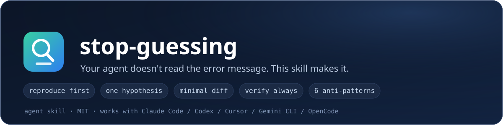
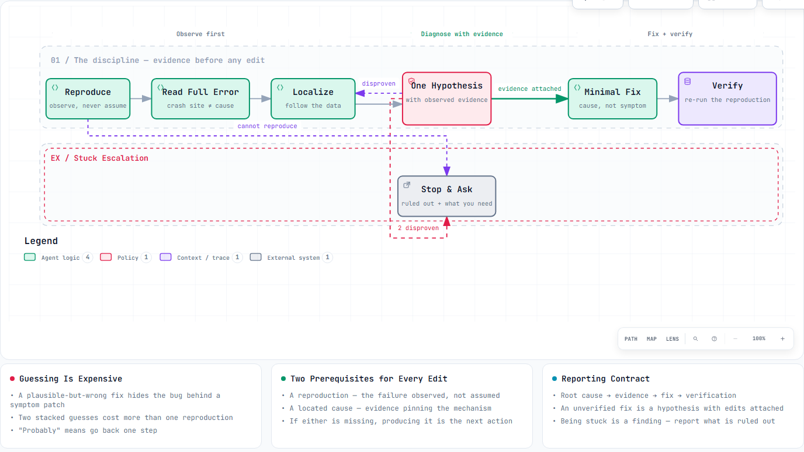

<p align="center">
  <strong>English</strong> · <a href="./README_zh-CN.md">简体中文</a>
</p>

<p align="center">
  
</p>

<p align="center">
  
  
  
  
  
</p>

<p align="center">
  
  
  
</p>

<p align="center"><em>Your agent doesn't read the error message. This skill makes it.</em></p>

An agent skill that replaces **"probably X, let me edit and see"** with a fixed debugging discipline: reproduce → localize → evidence → minimal fix → verify. If the skill is loaded, the agent physically cannot stack a guessed fix on top of another guessed fix — it has to show you the proof first.

Works with any agent that supports [Agent Skills](https://agentskills.io): Claude Code, Codex CLI, Cursor, Gemini CLI, OpenCode, and more.

## The discipline, as a map

<p align="center">
  
</p>

The map above is a live [Archify](https://github.com/tt-a1i/archify) diagram — open [`docs/stop-guessing-diagram.html`](docs/stop-guessing-diagram.html) in a browser for the interactive version (pan/zoom, path tracing, dark mode).

## The problem

Ask an agent to fix a bug and watch what happens:

> **Agent:** Ah, this is probably because the environment isn't loaded. *(adds `dotenv.config()`)* Let me also add a null check just in case. *(edits)* Should work now.

No reproduction. No evidence. Two changes stacked without running anything between them. The bug survives, hidden behind a symptom patch — and now you get to debug the patch too.

stop-guessing is one Markdown file that rewrites that behavior:

> **Agent (with skill):** Reproduced: `TypeError` at `parse.ts:88`, exits 1.
> Read the full trace — the crash is a consequence, not the cause. Followed the data: `config.headers` is undefined only when no auth token exists.
> **Root cause:** `buildConfig()` omits the `headers` default.
> **Fix:** 1 line, in `buildConfig()`. No other changes.
> **Verified:** original command now exits 0; `auth` test suite passes 14/14.

## Install

With the [Skills CLI](https://skills.sh):

```bash
npx skills add cv-superding/stop-guessing --global
```

Leave off `--global` to install only in the current project. Add `--agent '*'` to install for every detected agent.

Claude Code 2.1.142+ can also install it as a plugin:

```text
/plugin marketplace add cv-superding/stop-guessing
/plugin install stop-guessing@stop-guessing
```

Manual install: copy `SKILL.md` into your agent's skills folder.

## Usage

Nothing to learn. The skill triggers whenever you ask for a bug fix, paste an error, or say "it's broken" / "tests are failing" / "why does this crash".

Call it explicitly if you want:

```text
/stop-guessing
Tests in auth.test.ts fail on CI but pass locally. Find out why.
```

## What it enforces

| Without | With |
|---|---|
| Diagnose from the error's first line | Read the full trace; crash site ≠ cause |
| "Probably the env" | One hypothesis, with observed evidence attached |
| Fix + refactor + dep bump in one diff | Minimal diff; drive-bys proposed separately |
| "Fixed, should work now" | Re-run the original reproduction, show output |
| Silently retry the same command 5× | Two disproven hypotheses → report what's ruled out, ask for what only you know |

The full discipline — including six numbered anti-patterns with Before/After examples (*shotgun fix*, *symptom patching*, *narrated diagnosis*, *optimistic refactor*, *retry loop*, *confessing by silence*) — is in [`SKILL.md`](SKILL.md).

## Verify it works

Give your agent a bug and check the reply for the four required parts: **root cause → evidence → fix → verification**. If it ships an unverified fix, the skill isn't loaded — check `your-agent's skills list`.

## License

MIT
